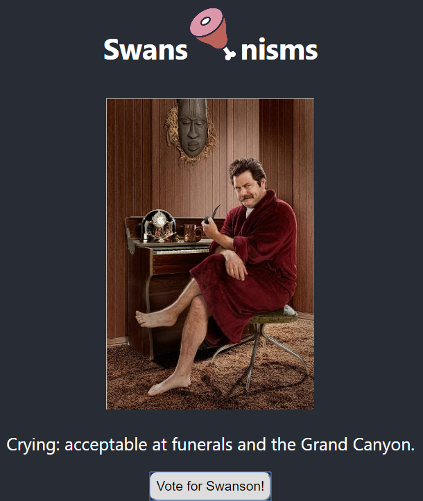

<a href="http://beautiful-hour.surge.sh" />

## Summary

In this assignment I was instructed to create the a Meme App using two API's

## Things Learned

Fetching data from API with axios and navigating through response data:

- Get
- Post
- Put
- Delete

## Technologies Used

- Axios
- Javascript - https://www.javascript.com/
- REACT - https://reactjs.org/
- CSS
- HTML
